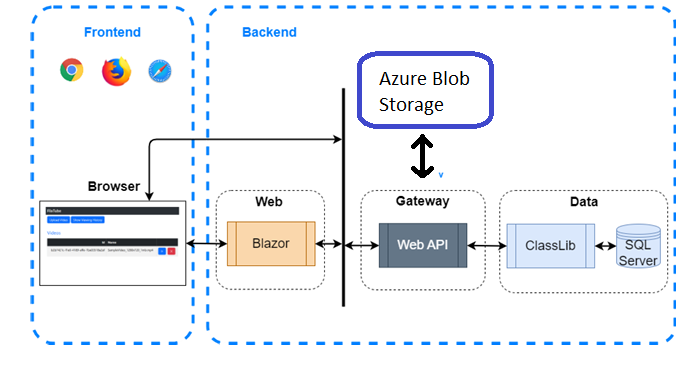
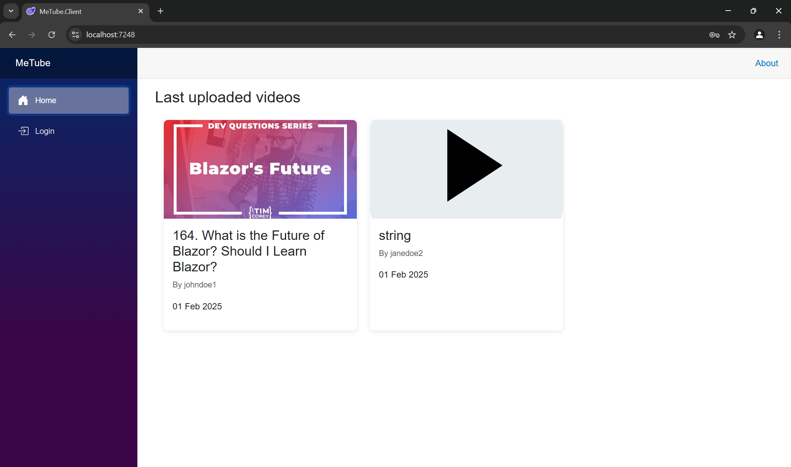
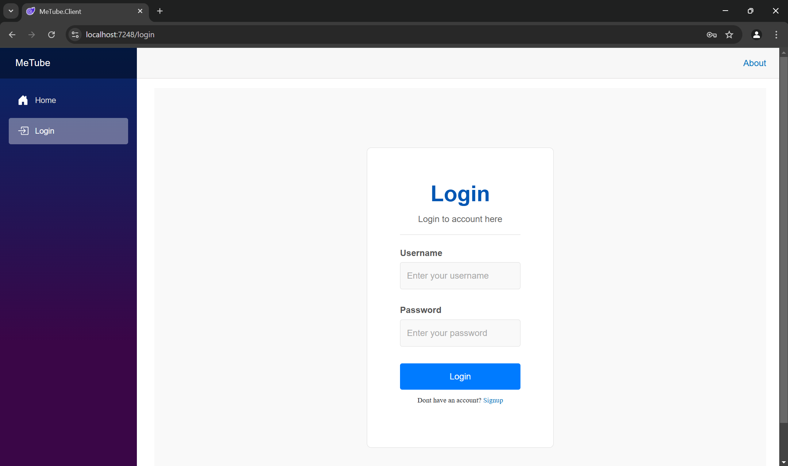
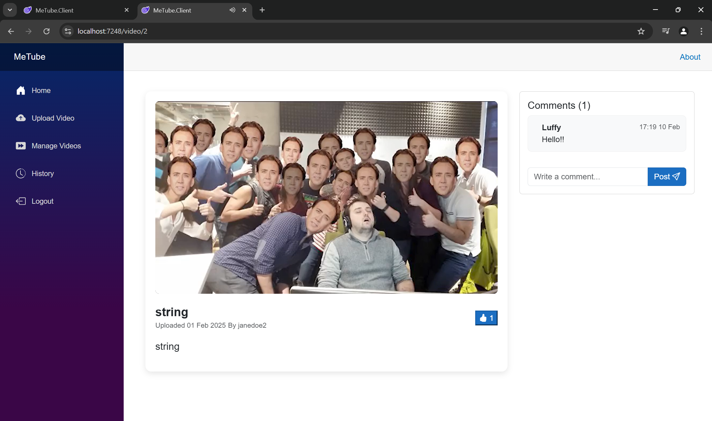
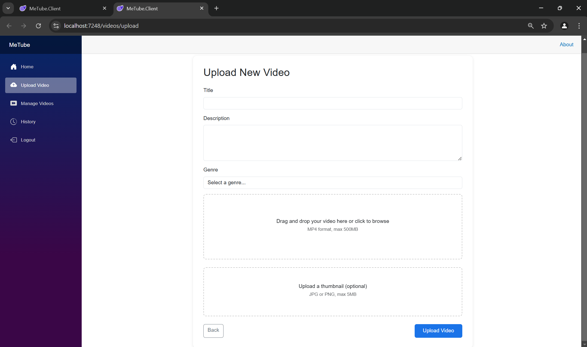
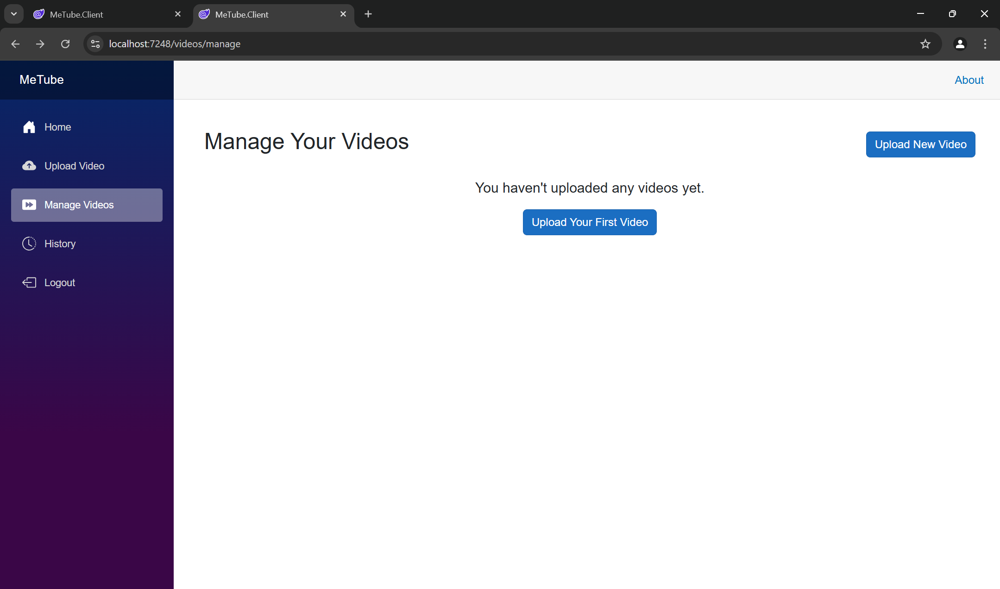
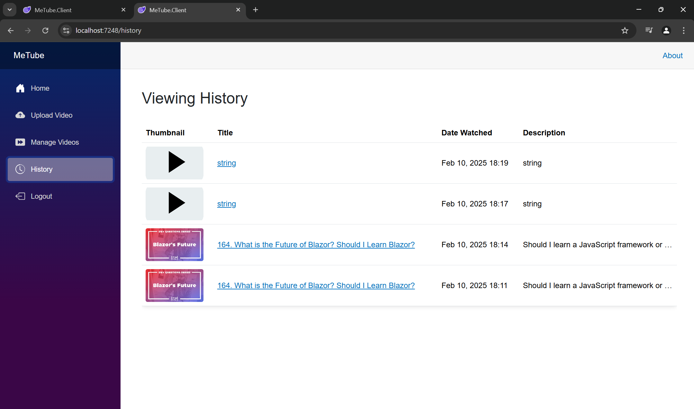

# MeTube

## Description
This is our group project for our Object Oriented Software Development course.

It's a simple YouTube-inspired web application that demonstrates core video streaming concepts—uploading, searching, and playing videos—while focusing on clean design and user-friendly interactions.

Authors: Ali Behrooz, Ronnie, Abdulla Mehdi, Oskar, Sebastian Svensson - Loop Legion


## Table of Contents
- [Documentation](#documentation)
- [Application Architecture](#application-architecture)
- [Screenshots](#screenshots)
- [Sprints](#sprints)
  - [Sprint 1](#sprint-1)
  - [Sprint 2](#sprint-2)
  - [Sprint 3](#sprint-3)
  - [Sprint 4](#sprint-4)

## Documentation
This section contains step-by-step instructions for setting up the project on your local computer.

### 1. Restore the database
To ensure you have a clean installation, you first need to restore the database:

#### 1.1 Remove migrations
- Locate and remove all migration files in the project
- Also remove the file `ApplicationDbContextModelSnapShot.cs`

#### 1.2 Remove the database
- Open SQL Server Object Explorer in Visual Studio (View -> SQL Server Object Explorer)
- Go to (localdb)\MSSQLLocalDB
- Expand the "Databases" dropdown
- Expand the "MeTubeDB" dropdown
- Right-click on the database
- Choose "Delete"

#### 1.3 Update the database
- Open the Package Manager Console (Tools -> NuGet Package Manager -> Package Manager Console)
- Right-click on MeTube.Data and select "Set as Start Up Project"
- Run the command: `update-database`
- Navigate to the gear icon next to the Start button and choose "new profile" (or the name you have assigned). This is so you can return to multiple startup projects.

### 2. Update from master

Retrieve the latest version from the master branch:
```bash
git pull origin master
```
Or in Visual Studio, select master and click the Pull button.


### 3. Configure User Secrets

This only needs to be done once on your local machine:

1. Open Developer PowerShell:
   - Go to `Tools -> Command Line -> Developer PowerShell`

2. Navigate to the API project:
   ```bash
   cd MeTube.API
   ```

3. Initialize user secrets:
   ```bash
   dotnet user-secrets init
   ```

4. Configure Azure Storage settings:
   ```bash
   dotnet user-secrets set "AzureStorage:AccountName" "looplegionmetube20250129"
   dotnet user-secrets set "AzureStorage:AccountKey" "xxxx"
   ```
   **DISCLAIMER: Contact us for the Azure Storage key!**
   Input the key instead of the x that are in between the citations.

After following these steps, the project should be properly configured and ready to run on your local machine.

## Application Architecture


Diagram of our application architecture.

## Screenshots
Screenshot of the Home page:



It shows the video selection and the sidebar.

---

Screenshot of the Login page:



This is where you input you user information to login.

---

Screenshot of the video viewing layout:



Our video layout, with a title, description, likes and a comment section.

---

Screenshot of the Upload Video page:



This is where you can upload your own videos.

---

Screenshot of the Manage Video page:



Here you can manage everything with your uploaded videos.

---

Screenshot of the History page:



On this page you can see your entire video viewing history.

## Sprints

### Sprint 1
#### Planning
- **Sprint Backlog**:
  - *User Story 1*: As a user I should be able to sign up so that I have a user account.
  - *User Story 2*: As a user, I want to log in using basic authentication with my username and password so that I can securely access my account.
  - *User Story 3*: As a user, I want to be able to log out so that I'm logged out.

#### Review
- **Completed**:
  - *User Story 1*: Implementation of registration functionality (Sign-Up).
- **Not Completed**:
  - *User Story 2*: Implementation of login functionality (the connection between API and client).
  - *User Story 3*: Implementation of logout functionality (not yet implemented).
- **Issues**:
  - Integration with the database took longer than expected.
  - We had environment setup issues.
  - Very short sprint period, only 3 days.


#### Retrospective
- **What went well**:
  - Clear communication in daily stand-ups.
  - Smooth process for defining user stories.
  - Good distribution of tasks.
  - Strong attendance and engagement
- **What could be improved**:
  - Unclear distribution of roles in certain parts of API development.
- **Amendments to process**:
  - Reconsider role distribution and possibly adapt a more vertical working approach.
  - Formalize code review steps.

---

### Sprint 2
#### Planning
- **Sprint Backlog**:
  - *User Story 1*: As a user, I want to be able to log out so that I'm logged out.
  - *User Story 2*: As an admin, I want to create, read, update, and delete user accounts so that I can manage users in the system.
  - *User Story 3*: As an authenticated user I want to manage my videos so that I can upload and delete them.
  - *User Story 4*: As an unauthenticated and authenticated user I want to be able to access videos so that I can watch them.
  - *User Story 5*: As a user, I want metadata about the video to be stored in persistent storage when a video is uploaded and removed when the video is deleted, so that I can efficiently manage and retrieve video information.
  - *User Story 6*: As an unauthenticated or authenticated user, I want to view a list of video metadata, so that I can quickly determine which videos are of interest to me before deciding to watch or take further action.

#### Review
- **Completed**:
  - *User Story 1*: Log out function implemented.
  - *User Story 2*: Admin account and functionality created and able to use CRUD operations in account management.
  - *User Story 3*: Video management and uploading functionality for users implemented.
  - *User Story 4*: Viewing of video content implemented.
  - *User Story 5*: Metadata implemented in the database and is deleted when video is deleted.
  - *User Story 6*: The client side still had CRUD functionality (list) left to implement but, we implemented it before the start of sprint 2.
- **Not Completed**:
  - All user stories completed by the start of the next sprint.
- **Issues**:
  - Problems with working vertically.

#### Retrospective
- **What went well**:
  - We basically managed to complete all user stories.
  - We did a lot, in a very short time span.
- **What could be improved**:
  - We bit off more than we could chew.
  - We should work on less user stories during our rather short sprints.
- **Amendments to process**:
  - Shorten the user stories during the next sprint.
  - Put less user stories in the Sprint Backlog.

---

### Sprint 3
#### Planning
- **Sprint Backlog**:
  - *User Story 1*: As an admin, I want to manage metadata so that I can create read update and delete metadata.
  - *User Story 2*: As an admin I want to manage videos so that I can upload, play, overwrite and delete videos.
  - *User Story 3*: As an authenticated user I want to be able to like a video so that I can show that I enjoyed it.
  - *User Story 4*: As an admin I want to manage likes for videos so that I can create, read, update and delete likes.
  - *User Story 5*: As an authenticated user I want to be able to post comments on videos so i can share my thoughts and have discussions about them.
  - *User Story 6*: As an admin I want to manage comments for videos so that I can edit or delete them.

#### Review
- **Completed**:
  - *User Story 1*: An admin now has full CRUD power for managing the metadata of all videos.
  - *User Story 2*: An admin can now fully modify all videos and their contents.
  - *User Story 3*: The ability to like a video and remove the like is fully functional and tied to every user.
  - *User Story 4*: An admin has the ability to modify the likes of any video.
  - *User Story 5*: We needed to implement the connection between the API and the client but, we finally finished it during the weekend before the next sprint.
  - *User Story 6*: We fully impelemented the admin functionality for the comment management.
- **Not Completed**:
  - All user stories where completed. User story 5 & 6 where finished during the weekend, right before sprint 4 started.
- **Issues**:
  - We had worsened our communication during this sprint.
  - We had less daily scrums this sprint.
  - We had to crunch some of the final user stories at the end of the sprint.

#### Retrospective
- **What went well**:
  - We developed a solid workflow with pull requests, linked to testing.
  - All work was completed.
  - We assigned estimates for the user stories using Scrum Poker.
  - We refrained from writing specific tasks for the user stories and will change that approach to defining a DoD (Definition of Done).
- **What could be improved**:
  - Better communication in the next sprint.
  - More daily scrums.
  - More feature testing
- **Amendments to process**:
  - More frequent check-ins, at least two times during a sprint.
  - We will start feature testing of the user stories that are already completed.

---

### Sprint 4
#### Planning
- **Sprint Backlog**:
  - *User Story 1*: As an authenticated user, I want to view my history so I can view the name and see when I have seen the videos.
  - *User Story 2*: As an admin, I want to manage history so that I can create, read, update and delete videos in history.
  - *User Story 3*: As a user, I want videos to be recommended to me based on a simple recommendation algorithm so that I can discover and enjoy content that matches my interests.

#### Review
- **Completed**:
  - *User Story 1*:
- **Not Completed**:
  - *User Story 2*: 
- **Issues**:


#### Retrospective
- **What went well**:
- **What could be improved**:
- **Amendments to process**:
