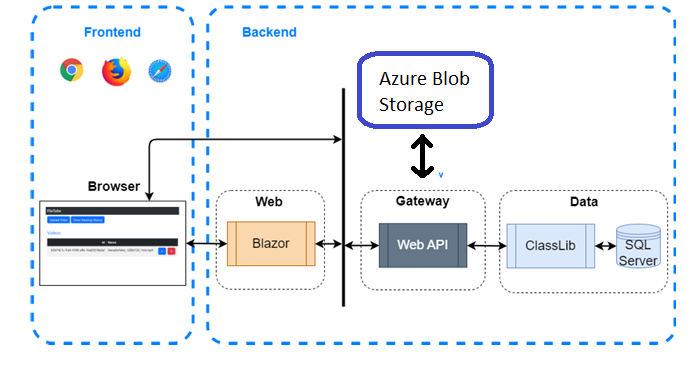
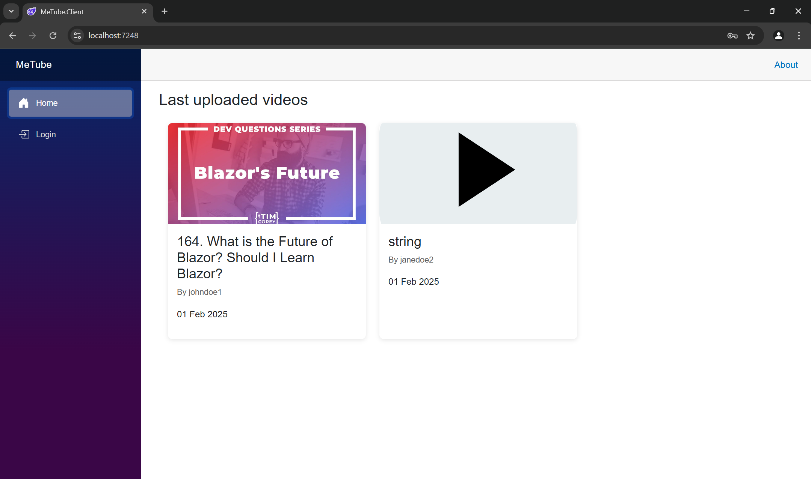
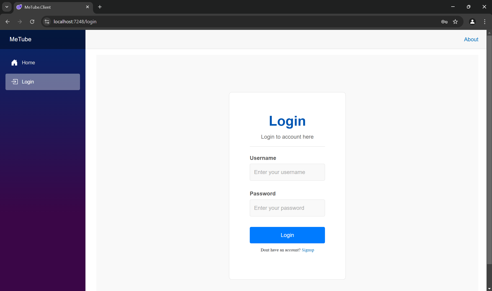
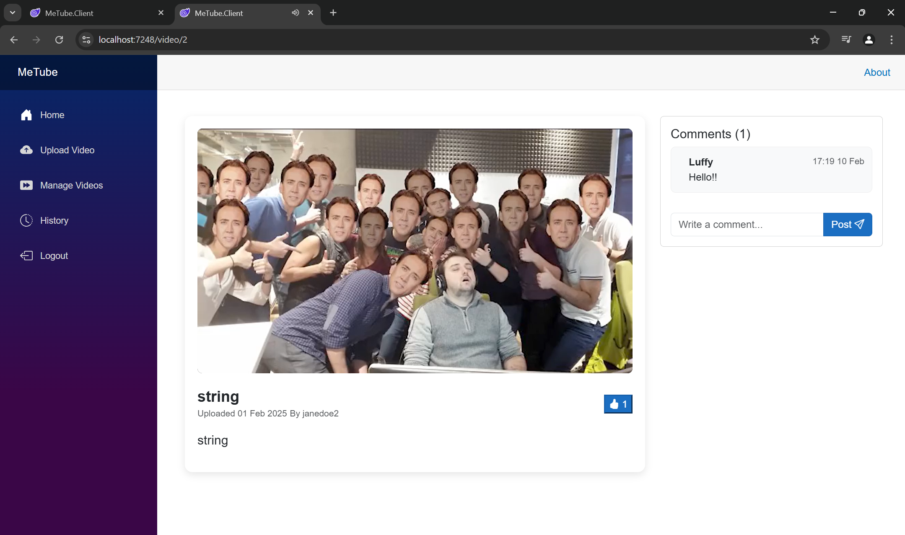
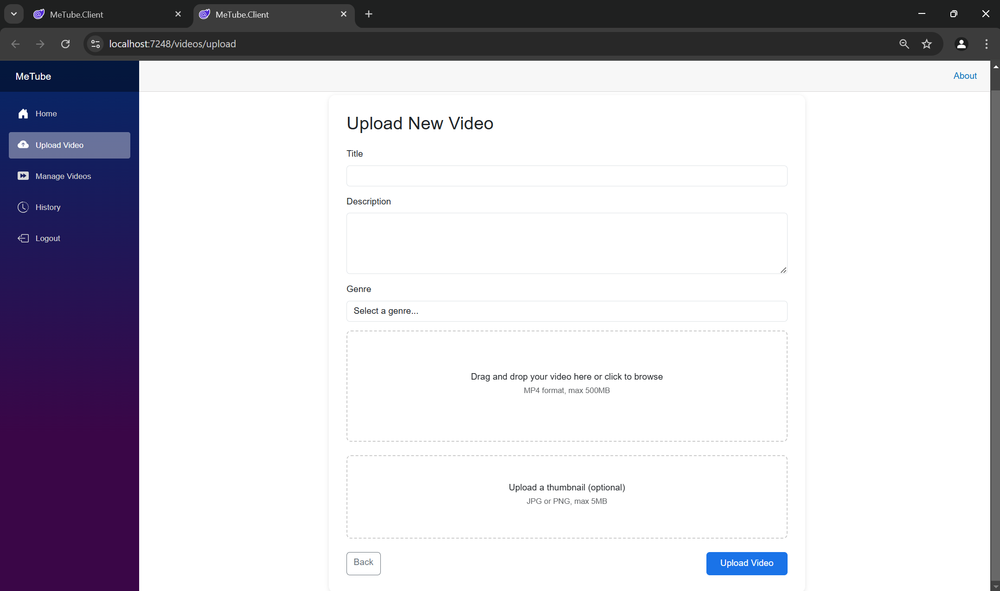
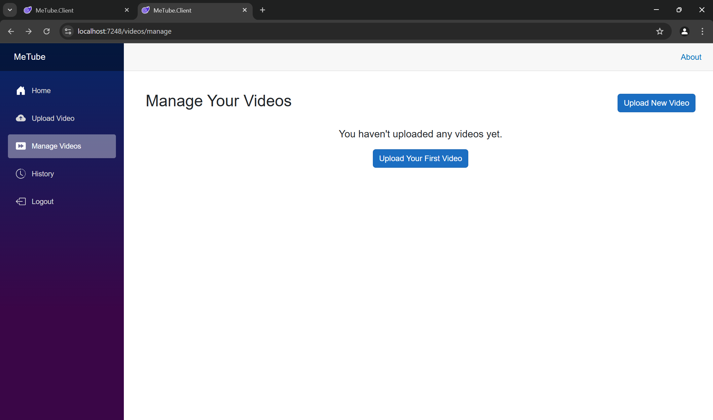
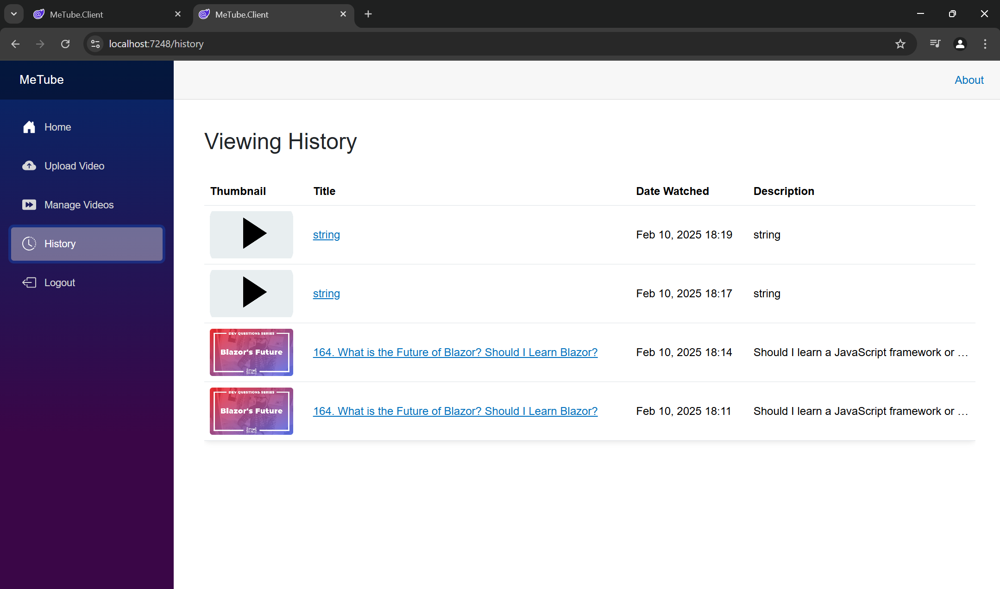

# MeTube

## Description
This is our group project for our Object Oriented Software Development course.

It's a simple YouTube-inspired web application that demonstrates core video streaming concepts—uploading, searching, and playing videos—while focusing on clean design and user-friendly interactions.

Users can sign up, log in, upload and manage their own videos, watch videos, like and comment on them, see their viewing history and get recommendations based on their most liked genre. Admins can manage users, videos, metadata, likes, comments and history.

Authors: Ali Behrooz, Ronnie, Abdulla Mehdi, Oskar, Sebastian Svensson - Loop Legion

Abdulla Mehdi's main areas in the git history are the Blazor client's view models and views, a large part of the test project and the EF Core migrations. In January 2026 Abdulla Mehdi also replaced the plain-text password storage with salted hashes and moved the JWT signing key to configuration.

## Table of Contents
- [Tech Stack](#tech-stack)
- [Getting Started](#getting-started)
- [Application Architecture](#application-architecture)
- [Screenshots](#screenshots)
- [Sprints](#sprints)
  - [Sprint 1](#sprint-1)
  - [Sprint 2](#sprint-2)
  - [Sprint 3](#sprint-3)
  - [Sprint 4](#sprint-4)

## Tech Stack
- **API:** ASP.NET Core Web API (.NET 9), Entity Framework Core 9 with SQL Server LocalDB, JWT bearer authentication, password hashing with ASP.NET Core's `PasswordHasher`, Azure Blob Storage for video files, AutoMapper and Swagger
- **Client:** Blazor WebAssembly (.NET 9) using MVVM with CommunityToolkit.Mvvm
- **Tests:** xUnit, Moq and FluentAssertions

## Getting Started

### Prerequisites
- [.NET 9 SDK](https://dotnet.microsoft.com/download/dotnet/9.0)
- SQL Server LocalDB (included with Visual Studio)
- EF Core CLI tools: `dotnet tool install --global dotnet-ef`
- A trusted HTTPS development certificate: `dotnet dev-certs https --trust`
- For uploading and playing videos: your own Azure Storage account

### 1. Clone and build
```bash
git clone https://github.com/Abdriano95/MeTube.git
cd MeTube
dotnet build
```

### 2. Create the database
```bash
dotnet ef database update --project MeTube.Data --startup-project MeTube.Data
```
This creates `MeTubeDB` on `(localdb)\MSSQLLocalDB` (see `MeTube.Data/appSettings.json`) with demo users, videos, likes, comments and history.

### 3. Configure secrets
```bash
dotnet user-secrets set "Jwt:Key" "<at least 32 random characters>" --project MeTube.API

# Needed for uploading and playing videos
dotnet user-secrets set "AzureStorage:AccountName" "<your storage account name>" --project MeTube.API
dotnet user-secrets set "AzureStorage:AccountKey" "<your storage account key>" --project MeTube.API
```
The API refuses to start without `Jwt:Key`. Without the Azure Storage settings, sign-up, login and user administration work, but the video endpoints return errors. The API creates the `videos` and `thumbnails` containers if they are missing. The seeded videos point to the original team's storage account, which no longer exists, so they will not play.

### 4. Run the API and the client
Run each command in its own terminal:
```bash
dotnet run --no-build --project MeTube.API --launch-profile https
dotnet run --no-build --project MeTube.Client --launch-profile https
```
Open https://localhost:7248. The client calls the API at `https://localhost:5001` (see `MeTube.Client/Constants.cs`), which is why the API is started with the `https` profile. Swagger is available at https://localhost:5001/swagger. Building once first and running with `--no-build` avoids both processes building the shared projects at the same time.

In Visual Studio you can instead set `MeTube.API` and `MeTube.Client` as multiple startup projects, both with the `https` profile.

### 5. Run the tests
```bash
dotnet test
```

### Login Details
- Username: `admin`
- Password: `adminpwd123`

## Application Architecture


Diagram of our application architecture.

## Screenshots
Screenshot of the Home page:



It shows the video selection and the sidebar.

---

Screenshot of the Login page:



This is where you input you user information to login.

---

Screenshot of the video viewing layout:



Our video layout, with a title, description, likes and a comment section.

---

Screenshot of the Upload Video page:



This is where you can upload your own videos.

---

Screenshot of the Manage Video page:



Here you can manage everything with your uploaded videos.

---

Screenshot of the History page:



On this page you can see your entire video viewing history.

## Sprints

### Sprint 1
#### Planning
- **Sprint Backlog**:
  - *User Story 1*: As a user I should be able to sign up so that I have a user account.
  - *User Story 2*: As a user, I want to log in using basic authentication with my username and password so that I can securely access my account.
  - *User Story 3*: As a user, I want to be able to log out so that I'm logged out.

#### Review
- **Completed**:
  - *User Story 1*: Implementation of registration functionality (Sign-Up).
- **Not Completed**:
  - *User Story 2*: Implementation of login functionality (the connection between API and client).
  - *User Story 3*: Implementation of logout functionality (not yet implemented).
- **Issues**:
  - Integration with the database took longer than expected.
  - We had environment setup issues.
  - Very short sprint period, only 3 days.


#### Retrospective
- **What went well**:
  - Clear communication in daily stand-ups.
  - Smooth process for defining user stories.
  - Good distribution of tasks.
  - Strong attendance and engagement
- **What could be improved**:
  - Unclear distribution of roles in certain parts of API development.
- **Amendments to process**:
  - Reconsider role distribution and possibly adapt a more vertical working approach.
  - Formalize code review steps.

---

### Sprint 2
#### Planning
- **Sprint Backlog**:
  - *User Story 1*: As a user, I want to be able to log out so that I'm logged out.
  - *User Story 2*: As an admin, I want to create, read, update, and delete user accounts so that I can manage users in the system.
  - *User Story 3*: As an authenticated user I want to manage my videos so that I can upload and delete them.
  - *User Story 4*: As an unauthenticated and authenticated user I want to be able to access videos so that I can watch them.
  - *User Story 5*: As a user, I want metadata about the video to be stored in persistent storage when a video is uploaded and removed when the video is deleted, so that I can efficiently manage and retrieve video information.
  - *User Story 6*: As an unauthenticated or authenticated user, I want to view a list of video metadata, so that I can quickly determine which videos are of interest to me before deciding to watch or take further action.

#### Review
- **Completed**:
  - *User Story 1*: Log out function implemented.
  - *User Story 2*: Admin account and functionality created and able to use CRUD operations in account management.
  - *User Story 3*: Video management and uploading functionality for users implemented.
  - *User Story 4*: Viewing of video content implemented.
  - *User Story 5*: Metadata implemented in the database and is deleted when video is deleted.
  - *User Story 6*: The client side still had CRUD functionality (list) left to implement but, we implemented it before the start of sprint 2.
- **Not Completed**:
  - All user stories completed by the start of the next sprint.
- **Issues**:
  - Problems with working vertically.

#### Retrospective
- **What went well**:
  - We basically managed to complete all user stories.
  - We did a lot, in a very short time span.
- **What could be improved**:
  - We bit off more than we could chew.
  - We should work on less user stories during our rather short sprints.
- **Amendments to process**:
  - Shorten the user stories during the next sprint.
  - Put less user stories in the Sprint Backlog.

---

### Sprint 3
#### Planning
- **Sprint Backlog**:
  - *User Story 1*: As an admin, I want to manage metadata so that I can create read update and delete metadata.
  - *User Story 2*: As an admin I want to manage videos so that I can upload, play, overwrite and delete videos.
  - *User Story 3*: As an authenticated user I want to be able to like a video so that I can show that I enjoyed it.
  - *User Story 4*: As an admin I want to manage likes for videos so that I can create, read, update and delete likes.
  - *User Story 5*: As an authenticated user I want to be able to post comments on videos so i can share my thoughts and have discussions about them.
  - *User Story 6*: As an admin I want to manage comments for videos so that I can edit or delete them.

#### Review
- **Completed**:
  - *User Story 1*: An admin now has full CRUD power for managing the metadata of all videos.
  - *User Story 2*: An admin can now fully modify all videos and their contents.
  - *User Story 3*: The ability to like a video and remove the like is fully functional and tied to every user.
  - *User Story 4*: An admin has the ability to modify the likes of any video.
  - *User Story 5*: We needed to implement the connection between the API and the client but, we finally finished it during the weekend before the next sprint.
  - *User Story 6*: We fully impelemented the admin functionality for the comment management.
- **Not Completed**:
  - All user stories where completed. User story 5 & 6 where finished during the weekend, right before sprint 4 started.
- **Issues**:
  - We had worsened our communication during this sprint.
  - We had less daily scrums this sprint.
  - We had to crunch some of the final user stories at the end of the sprint.

#### Retrospective
- **What went well**:
  - We developed a solid workflow with pull requests, linked to testing.
  - All work was completed.
  - We assigned estimates for the user stories using Scrum Poker.
  - We refrained from writing specific tasks for the user stories and will change that approach to defining a DoD (Definition of Done).
- **What could be improved**:
  - Better communication in the next sprint.
  - More daily scrums.
  - More feature testing
- **Amendments to process**:
  - More frequent check-ins, at least two times during a sprint.
  - We will start feature testing of the user stories that are already completed.

---

### Sprint 4
#### Planning
- **Sprint Backlog**:
  - *User Story 1*: As an authenticated user, I want to view my history so I can view the name and see when I have seen the videos.
  - *User Story 2*: As an admin, I want to manage history so that I can create, read, update and delete videos in history.
  - *User Story 3*: As a user, I want videos to be recommended to me based on a simple recommendation algorithm so that I can discover and enjoy content that matches my interests.

#### Review
- **Completed**:
  - *User Story 1*: History is now fully implemented and is viewable from the "History" tab.
  - *User Story 2*: Admin functionality implemented.
  - *User Story 3*: The algorithm has been fully implemented and works by checking your most liked video genre.
- **Not Completed**:
  - All user stories are completed.
- **Issues**:
- No noticable issues were present in this sprint.

#### Retrospective
- **What went well**:
- Communication has been improved drastically, compared to earlier sprints
- Testing has been the focus of this sprint, new bugs and issues related were found thanks to testing 
- **What could be improved**:
- Time management, we could estimate the time of each user story better
- **Amendments to process**:
- Since this is the last sprint there is not going to be any adjusments. 
